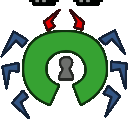

+++
title = "Communication visuel et logos"
description = "Images, logos, et autres visuels utilisés pour communiquer autour de l'"
aliases = ["documentation/association/visuels"]
[extra]
translations = [
    "activities/association/imagery/index.en.md"
]
+++

# Visuels et logos

La plupart des images datant d'entre 2017 et 2019 ont été dessinées par pk sur
papier, et sur ordinateur avec Gimp, Inkscape et Blender.

## Logo actuel, précédents, et recherche préliminaire

### Logo utilisé de mai 2017 à aujourd'hui
{{ picture(file="activities/association/imagery/asn-logo.svg" width=200) }}

#### Versions noir et blanc
{{ picture(file="activities/association/imagery/asn_bw.png" width=200) }}

#### Emojis et images animés

Quelques images créées à l'origine pour être utilisées sur le slack de 42.

{{ picture(file="activities/association/imagery/gnu-sans-nom-2.svg" width=200) }}
{{ picture(file="activities/association/imagery/gnu-sans-nom.svg" width=200) }}
{{ picture(file="activities/association/imagery/android-sans-nom.svg" width=200) }}

### Images de profil du bot slack
{{ picture(file="activities/association/imagery/asn_slack.svg" width=200) }}
{{ picture(file="activities/association/imagery/megaphone.png" width=200) }}
{{ picture(file="activities/association/imagery/asn_slack.png" width=200) }}
{{ picture(file="activities/association/imagery/asn_slack2.png" width=200) }}
{{ picture(file="activities/association/imagery/asn_annonce.svg" width=200) }}

### Expérimentations avec de la 3D (et Blender)
{{ picture(file="activities/association/imagery/asn_2-5d.svg" width=200) }}
{{ picture(file="activities/association/imagery/asn_3d_croped.png" width=200) }}
{{ picture(file="activities/association/imagery/asn_3d.png" width=200) }}

### Recherche du logo (milieu 2017)

#### Deuxième phase de recherche du logo
{{ picture(file="activities/association/imagery/asn-logo-os_lock.svg" width=200) }}
{{ picture(file="activities/association/imagery/asn_logo_bugopenlock_4legs.svg" width=200) }}
{{ picture(file="activities/association/imagery/asn_logo_bugopenlock.svg" width=200) }}
{{ picture(file="activities/association/imagery/asn_logo_bugopenlock_shaded.svg" width=200) }}
{{ picture(file="activities/association/imagery/asn_logo_bugopenlock_shaded_uncroped.svg" width=200) }}
{{ picture(file="activities/association/imagery/asn_logo.svg" width=200) }}
{{ picture(file="activities/association/imagery/asn_logo_withname.svg" width=200) }}
{{ picture(file="activities/association/imagery/asn_logo.svg.2017_05_01_22_58_18.0.svg" width=200) }}
{{ picture(file="activities/association/imagery/téléchargement2.svg" width=200) }}
{{ picture(file="activities/association/imagery/asn_logo_violet.svg" width=200) }}
{{ picture(file="activities/association/imagery/asn_logo_noeyebleeding.svg" width=200) }}

#### Première phase de recherche du logo (milieu 2017)
{{ picture(file="activities/association/imagery/idees_logo.svg" width=200) }}
{{ picture(file="activities/association/imagery/idees_logo_2.svg" width=200) }}
{{ picture(file="activities/association/imagery/pengonymous_.svg" width=200) }}

### Images pour le formulaire précédant la première réunion (début 2017)
{{ picture(file="activities/association/imagery/Numérisation_20161117.jpg" width=200) }}
{{ picture(file="activities/association/imagery/asn_survey_icons.svg" width=400) }}
