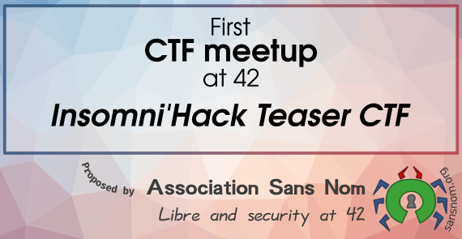

+++
title = "Insomni'Hack Teaser CTF"
description = "Tackling Insomni'Hack Teaser CTF at 42 with "
date = 2020-01-18
sort_by="weight"
[extra]
subpages_title = "Liste des Write-ups"
translations = [
    "activities/workshops/ctf-meetups/insomnihack/_index.md"
]
+++

## Insomni'Hack Teaser CTF

Let's make a good start this year, with a proposition from [Association Sans
Nom](https://sansnom.org) to take a stab at computer security with an challenge
online : the [Teaser
CTF](https://teaser.insomnihack.ch/) of
[Insomni'Hack](https://www.insomnihack.ch/), which **will start at 10:00 on
Saturday, January 18, and last 24 hours.**.

The idea is to get together in the cluster to help each other and share a good
time.
You can show up and leave when you want, although it's obviously more enjoyable
to start at the same time.

The only prerequisite is a craving for brain-teasers and some curiosity.
If it works for you, don't hesitate to join us in the first rows, right of E2.
