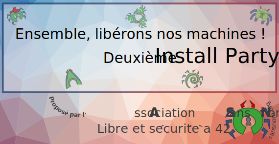

+++
title = "Deuxième install party"
description = "Deuxième install party à 42 organisée par l'"
date = 2019-10-16
aliases = ["activités/install_party/party-42-2"]
[extra]
place = "Heart of Code (42)"
translations = [
    "activities/workshops/install-party/party-42-2/index.en.md"
]
+++

# Deuxième install party à 42 pour les étudiants et le staff

L'[Association Sans Nom](https://sansnom.org/), association autour du *Libre*
et de la *sécurité* à 42, vous invite à sa deuxième [Install
Party](@/activities/workshops/install-party/_index.md).
Vous voulez **installer un système d'exploitation et des logiciels Libres sur
vos machines** (ordinateur, téléphone, raspberry pi…) ? **Nous voulons vous y
aider !**
Les **demandes de conseils** et **discussions** sont évidemment bienvenues.
Si vous voulez **donner un coup de main**, ça sera grandement apprécié ; faites
nous signe.
*Nous vous invitons à amener un petit quelque chose à manger ou à boire pour
les partager tous ensemble <small>(désolé, on n'offre pas de pizza cette
fois-ci)</small>.*

## Informations pratiques

*Par* l'**Association Sans Nom** et les bonnes volontés qui veulent aider,  
*pour* **les étudiants et le staff de 42**,  
*le* **samedi 16 novembre**, entre 14h et 18h,  
*en* **Terre du Milieu**, à 42 Paris.

## Pourquoi venir ?

- Pour choisir un système qui vous convient et libérer une machine
- Pour partager un moment convivial et discuter, un verre (de soft) à la main
- Pour découvrir le Libre et l'Open Source, trouver des logiciels et des projets
- Pour rencontrer l'Association Sans Nom, et pourquoi pas nous rejoindre

Vous pouvez poser vos questions [sur slack](@/contact/index.fr.md) ou <a
href="mailto:{{ mail(to="bureau") }}">envoyer un e-mail au bureau de
l'association</a>.

**Si vous pouvez nous donner quelques informations à l'avance en remplissant
[ce formulaire](https://framaforms.org/install-party-2-avec-lassociation-sans-nom-1572862082#endprelude),
ça facilitera grandement les choses…**
