+++
title = "write up de nidzik"
weight = 0
aliases = ["activités/ateliers-pentest/pentest01/nidzik"]
[extra]
author = "nidzik"
points = 130
translations = [
    "activities/workshops/pentest/pentest01/nidzik/index.en.md"
]
+++

## First of all do a scan of the network to find the ip of th vm:

### arp-scan

``` sh
arp-scan -l -I eth0
```

- `-l --localnet` generate addresses from the local network
- `-I` specify the network interface


- `10.0.2.1/3` are used by virtualbox.
- `10.0.2.7` this one is instersting !

## Scan for the most commons names

### dirb

``` sh
dirb http://10.0.2.7
```

by defaut dirb scan the port 80.

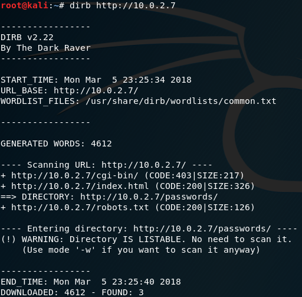

 `http://10.0.2.7/passwords/` that must be good..

### Checking the passwords/ direcory

----------

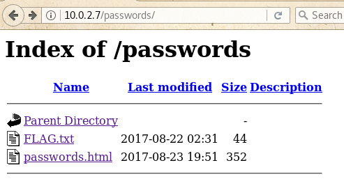

Is that the frist flag ??


Yes it is, nice ! Let's go on.
We'll now check the other page:


Humm.. nothing here but there was a password but Rick has hidden it.
and if we looking for hidden things..

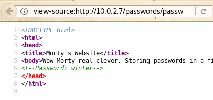

hidden things we found !!

* we've got a password `winter` let's keept that in mind.

----------

### Checking the robot.txt file


`root_shell.cgi` looks nice but it's a fake, there is nothing.

maybe we'll get more luck with `tracertool.cgi`

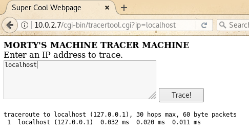

if we submit a random value like `AAAAAAAAAAAA` it print nothing
but if we give a good parameter to the Morty's tracertool it returns `traceroute to localhost (127.0.0.1)`

* traceroute is a linux cmd.

*That's mean somehow there is a command executed in the shell.
* So maybe we can use the propriety of the shell to get more liberty with this tool.
We can try to use the `;`

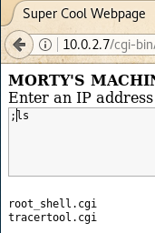


lets take a look at the `/etc/passwd` file

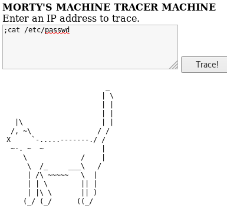

oops `cat` seems broken ^^ `tail` is a good alternative

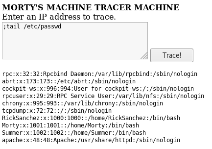

We have now 3 username: `RickSanchez` `Morty` `Summer`

----------

### quick step back, why can we execute several commands with `;`

take a look at the source code of `tracertool.cgi`

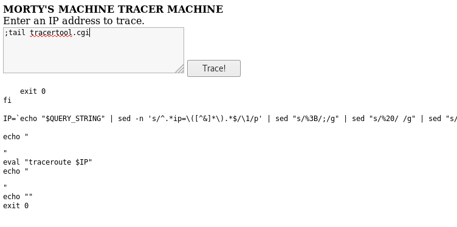

* it first "reverse" the html encoding with several `sed`
* then `eval` of `traceroute + $our_string`

from the man:

```
eval

Evaluate several commands/arguments

Syntax
      eval [arguments]

The arguments are concatenated together into a single command, which is then
read and executed, and its exit status returned as the exit status of eval.
If there are no arguments or only empty arguments, the return status is zero. 
```

that mean eval just give the whole chain to bash and this one interpret it.

----------

we can't do much more with the apache user.

## More Scans ..

### nmap

``` sh
nmap -p- -T5 -A -sV 10.0.2.7
```

* `-p-` scan from port 1 to port 65586
* `-T5` to scan faster

* `-A` which turns on version detection and other Advanced and Aggressive features
* `-sV` To enable version detection

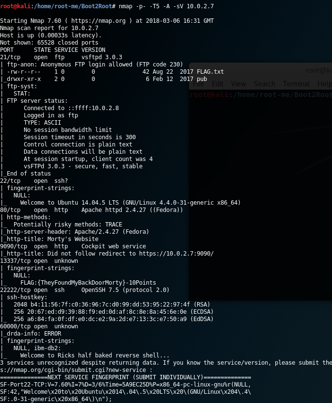

### Port 21

ftp classic, we can see we have acces to the anonymous user and there is probably a flag here:

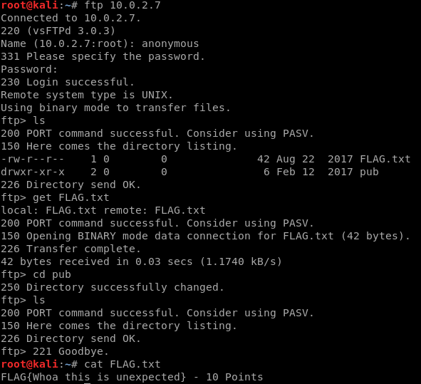

### Port 22

nmap guess that is a ssh port because it's on port 22 but it's not.

### Port 9090

just check it on your browser:

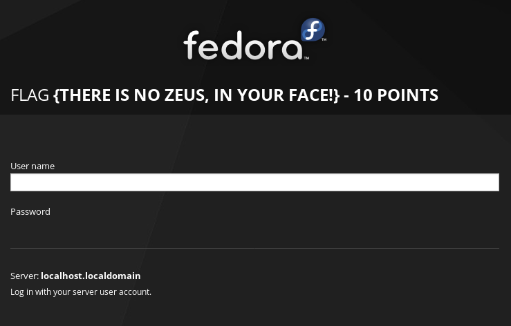

nice one more !

### Port 60000

reverse shell from Rick.
let's try to connect with `nc`


### Port 22222

ssh port, we need a username and a password.
so far we discover 3 usernames `RickSnachez` `Morty` `Summer` and one password `winter` (:80/passwords/passwords.html)

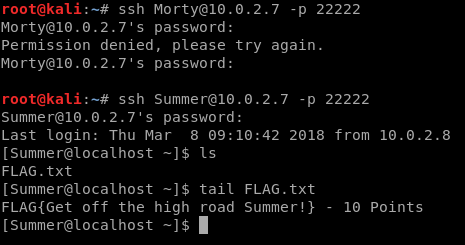

nice one more flag found and we are on the machine !
with some digging we find out that we have the right permissions to access to Morty's home.
Morty has a zip file protected by a password. And an img who's probably hide the password.
the password seems to look like `Meeseek`

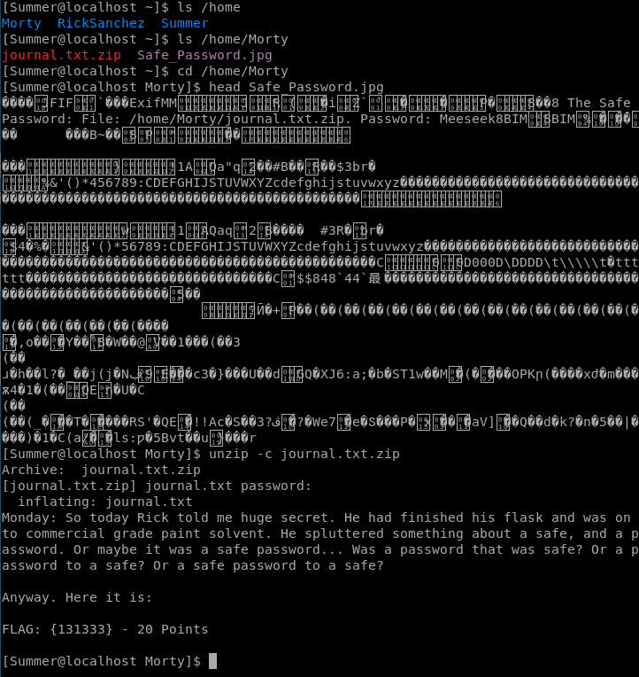

all right ! next step hack Rick's safe !
after some trys i realize that the flag we got right before is a little weird

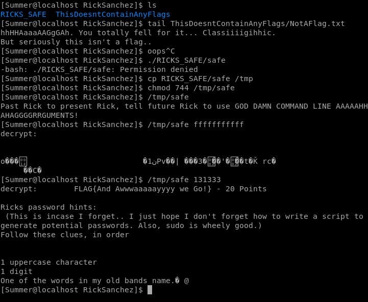

we got a hint for the last lvl
just create a passwd list with this pattern:
UP_LETTER + DIGIT + Curtains (the band group is The Flesh Curtain, and curtains seems right for the passwd )
a little and dirty python script  + `hydra`

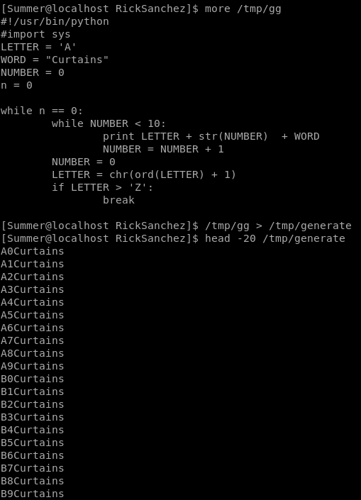


Root -- Last Flag :D

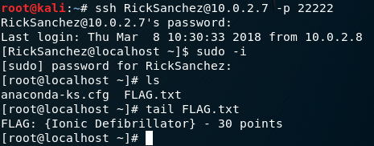
