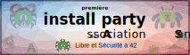

+++
title = "Première install party"
description = "Première install party à 42 organisée par l'"
date = 2019-05-17
[extra]
place = "Heart of Code (42)"
+++

# Première install party à 42 pour les étudiants et le staff

**Vendredi 17 mai**, en fin d'après-midi, en **Terre du Milieu**, viens **libérer ton ordinateur, ton smartphone** ou ton grille-pain connecté en y installant un système d'exploitation et des logiciels Libres, tout en discutant autour d'une pizza lors de la **première install party de l'[Association Sans Nom](https://sansnom.org/)**, association pour le Libre et Sécurité à 42.

Une [Install Party](./activités/install_party/_index.md) est un évènement festif qui permet de rencontrer des utilisateurs expérimentés de systèmes ou de logiciels Libres (tels que Linux) qui pourront aider à installer un système Libre sur sa propre machine et/ou à le configurer, et à partager leur expérience.

Tu veux quelque chose de **simple** comme **Ubuntu** ?
Nous serons à tes côtés pendant que tu cliques frénétiquement sur le boutton « suivant » et choisis entre deux ou trois options.

Tu souhaites plus de **liberté** avec **Fedora** ou **Debian** ?
Nous chercherons avec toi le fameux pilote de ta carte WiFi.

Au fait, j'utilise **Arch Linux**. 😛

Si c'est plutôt ton **téléphone** ou ta **tablette** qui t'intéresse, nous avons moins d'experts, mais nous espérons que des gens expérimentés en flashage de ROMs Libres comme **LineageOS** ou **Replicant** passeront nous donner un coup de main.

Pour les **routeurs** et autres autres ordinateurs **monocarte**, nous tenterons d'être au point sur **OpenWRT** et **Raspbian**.

Tu comptes installer quelque chose de plus exotique, comme NixOS, un BSD ou Qubes OS ?
Préviens-nous, que nous nous préparions psychologiquement.

Tu vas remplacer ton BIOS par CoreBoot, installer LFS sur un disque entièrement chiffré en raid 10 avec la partition d'amorçage sur une clé USB ?
On commence à chercher le numéro d'un bon dealer.
