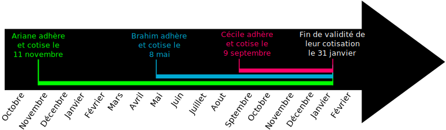

+++
title = "Adhésion à l'association et cotisation"
description = "Documentation à propos de l'adhésion et de la cotisation pour rejoindre l'"
+++

## Adhésion à l'Association Sans Nom

Les membres [adhèrent](@/adhérer/index.md) jusqu'au 31 janvier suivant la date
à laquelle ils paient leur cotisation. Une exception est faite s'ils paient la
cotisation durant les deux derniers mois de l'année (novembre et décembre).
Dans ce cas, leur adhésion dure un an de plus (13 ou 14 mois au lieu de 1 ou 2
mois).

