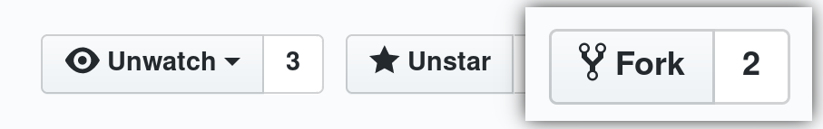
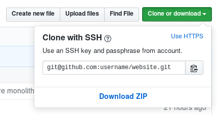
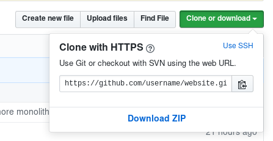
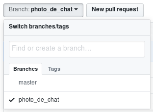
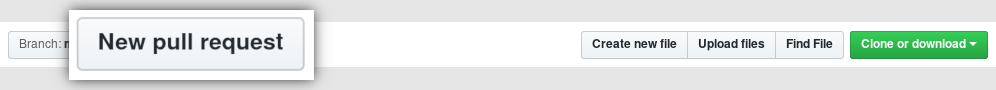
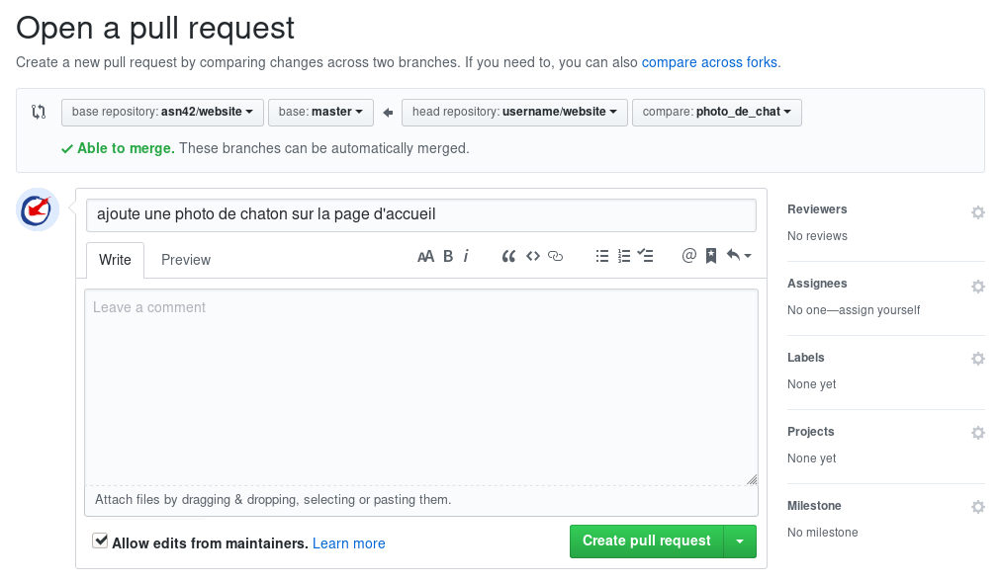

+++
title = "Pull request Github"
description = "Faire une pull request sur Github avec l'aide de l'"
[extra]
translations = [
    "documentation/logiciel_libre/pull_request/index.en.md"
]
+++

# Faire une pull request sur Github

Nous prendrons comme exemple le site de l'Association Sans Nom.

## Fork

Faites un fork du dépôt original en utilisant le
bouton _Fork_.



## Clone

[Clonez](https://www.git-scm.com/docs/git-clone) votre nouveau dépôt (le fork).

### SSH
Si vous avez [ajouté une clé ssh à votre compte
Github](https://help.github.com/en/articles/adding-a-new-ssh-key-to-your-github-account) :



``` sh
git clone git@github.com:username/website.git
```

### HTTPS

Sinon :



``` sh
git clone https://github.com/username/website.git
```

## Remote

Ajoutez comme remote l'adresse HTTPS du dépôt original (on l'appellera
_upstream_) :

``` sh
git add remote upstream {{ source_link() }}.git
```

## Branche

Après avoir [synchronisé](https://git-scm.com/docs/git-fetch) la branch
_master_ du remote _upstream_, créez [une nouvelle
branche](https://git-scm.com/docs/git-branch) depuis celle-ci et [passez
dessus](https://git-scm.com/docs/git-checkout) pour travailler sur un bug ou
une fonctionnalité :

``` sh
git fetch upstream master
git checkout upstream/master
git checkout -b photo_de_chat
```

## Modifications

Modifiez ensuite le contenu ou le code en essayant de faire des messages de
[commit](https://git-scm.com/docs/git-commit) explicites.

``` sh
cp ~/Téléchargements/chaton.jpg content/chaton.jpg
vi content/_index.md
git add content/_index.md content/chaton.jpg
git commit -m "ajoute une photo de chaton sur la page d'accueil"
```

## Garder la branche à jour

Si des modifications ont été fait sur le dépôt original pendant que vous
travailliez dans votre branche, vous pouvez mettre à jour votre branche
_master_ et les récupérer dans votre branche :

``` sh
git checkout master
git pull upstream master
git push origin master
git checkout photo_de_chat
git rebase master
```

### Conflits

Si des modifications qui ont été faites sur la branche master entrent en
conflit avec vos modifications, [résolvez les
conflits](https://help.github.com/en/articles/resolving-a-merge-conflict-using-the-command-line),
puis continuez le _rebase_.

``` sh
git rebase --continue
```

## Push

Quand vous êtes satisfait de vos modifications, envoyez les sur votre dépôt :


``` sh
git push origin photo_de_chat
```

## Pull request

Enfin, faites une pull request sur Github.

Si vous avez poussé vos commits sur la branche récemment, un bouton _Compare &
pull request_ pour cette branche est directement visible.


Sinon, passez sur la branche en question et utilisez le bouton _New pull
request_.





Vous pouvez ajouter des commentaires à la pull request, puis la soumettre en
cliquant sur le bouton _Create pull request_.



## Corrections

Si vous avez des améliorations ou des corrections à faire à votre pull request,
ou si on vous demande d'y changer quelque chose pour qu'elle puisse être
acceptée, vous pouvez ajouter des commits ou en modifier sur la branche sur
laquelle vous avez travaillé. Cela sera appliqué à la pull request.
