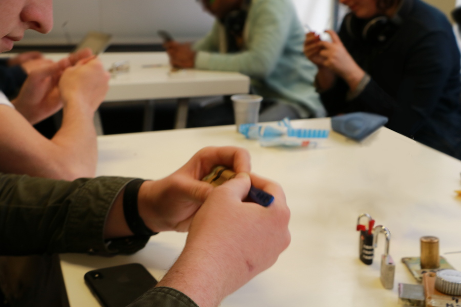

+++
title = "Lock picking / crochetage"
description = "Ateliers lock picking pour s'initier l'art du crochetage avec l'"
date = 2017-03-21

template = "page.html"
render = true

[extra]
+++

## Présentation du lock picking

Le lock picking (crochetage) est l'art de l'ouverture de serrures de manière "fine", non destructrice et ce pour tout type de serrures, y compris les serrures électrique.

En fonction du type de la serrures, différentes technique seront disponible afin d'ouvrir celle-ci.

## Le lock picking à l'Association Sans Nom

Dans le cadre des ateliers à l'ASN, nous présentons le fonctionnement de serrures, leur défauts, ainsi que les alternatives qui ont été crée afin de parer à ces défauts.

Nous utilisons principalement des serrures paracentrique, du fait de leurs simplicité de fonctionnement, d'achat de matériel et d'accessibilité à de nouvelle serrures.

Nous utilisons aussi des méthodes de crochetage avec crochet afin de préserver un maximum le matériel, mais explorons aussi les méthodes dites "Brute force" sur des serrures en fin de vie, y compris pour le lock picking.

Enfin, le crochetage présenté en atelier est à pour seul et unique but récréatif, pratiquer sur des serrures dédié uniquement aux atelier, dans le cadre de la loi. Nous décourageons et n'accepton pas l'utilisation de ces pratiques en dehors du cadre légale.

### Ateliers réguliers

Des ateliers de découverte sont réalisé régulièrement (environs toutes les deux semaines) au sein de 42, le samedi après-midi. Tout niveau est bienvenu, avec ou sans matériels. Afin de faire participer un maximum de personnes, nous encourageons les participants à ramener leurs kits et serrures dédié.

### Commandes groupées de kits, serrures et cadenas d'entraînement

Nous réalisons régulièrement des commandes groupé, permettant d'avoir des prix chez notre partenaire ouverture-fine.com. Les commandes présentes une liste de matériels conseillé pour leur durabilité et solidité, au détriment parfois du prix, mais tout ajout en dehors de la liste est possible, vous permettant d'économiser sur les frais de port

Nous encourageons à acheter du matériels de bonne qualitée, et d'éviter les kits bas de gamme contenant beaucoup d'outils, qui auront plus de chance de casser et donc, en plus, endommager une serrure qui pourrait valoir le prix du kit. Un exemple, un pick de bonne qualité tourne autour des 3-5 euros

### Évènements extérieurs

Nous proposons aussi parfois des ateliers lors d'évènement extérieur, avec une présentation de la discipline et de la pratique accessible à tous. l'idée principale étant de montrer le fonctionnement des serrures, leurs point faible mais aussi les alternatives.
